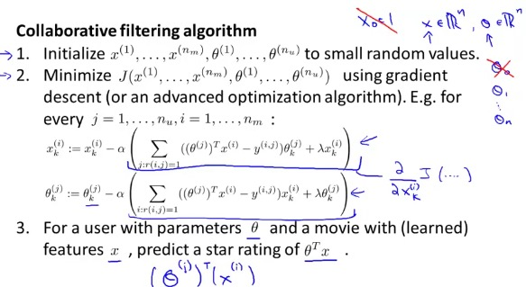

# Machine Learning - Week 9 - Recommender Systems

- Recommender systems are one ML application that many are excited to try and improve
- Receives less attention in academia.

Example: Movie ratings

A company that rents movies, users rate movies 0-5 stars. There are four users.

Notations:

- Seems alice and bob give high ratings to romantic comedies and they don't like action movies. Carol and dave like action movies but not romantic comedies.
- when r(i,j) = 1 then we also have a y(i,j) rating for the movie.
- Try to predict number in the question mark.

## Content based recommender

- let's say for each movie we have attribute (romance or action 0-1).
- If have we have the attributes we can represent them as feature vector. $ x^{(1)} = \begin{bmatrix} 1 \\ 0.9 \\ 0 \end{bmatrix} $
- n = 2 since we have two features
- For each user we have a separate training to do. Learn the parameter $ \theta \in \mathbb{R}^{n+1} $. Predict user j rating movie i with $ (\theta^{(j)})^Tx^{(i)} $
- For example, each user will have a separate $ \theta $ variable. So for Alice her vector for x(3) is [1; 0.99; 0] and for her the theta is [0;5;0]. The inner product will be 4.95

Problem formulation:

- $ n_u $ = amount of users
- r(i,j) = 1 if user j has rated movie i
- y(i,j) = rating by user j on movie i
- theta(j) = parameter vector for user j
- x(i) = feature vector for movie i
- for user j, movie i, predict rating using (theta(j)^T)x(i), $ \large \theta \in \mathbb{R}^{n+1} $
- m(j) = no of movies rated by user j
- To learn theta(j):

$$ \large \min_{\theta^{(j)}} = \frac{1}{2}\sum_{r:i(i,j)=1}((\theta^{(j)})^T(X^{(i)}) - y^{(i,j)})^2 + \frac{\lambda}{2}\sum_{k=1}^n(\theta_k^{(j)})^2 $$

- **Optimization Algorithm**: To learn $ \theta^{(1)}, \theta^{(2)},...,\theta^{(n)} $:

 $$ \large \min_{\theta^{(1)},...,\theta^{(j)}} = \frac{1}{2}\sum_{j=1}^{n_u}\sum_{r:i(i,j)=1}((\theta^{(j)})^T(X^{(i)}) - y^{(i,j)})^2 + \frac{\lambda}{2}\sum_{j=1}^{n_u}\sum_{k=1}^n(\theta_k^{(j)})^2 $$

 
 - alpha - the learning rate. Different rate for k=0 and k!=0
 - Almost the same as linear regression except we removed 1/m

 ## Collaborative Filtering
 

 - Sometimes we don't have features for the movies.
 What if we the users told us how much they liked action movies or romantic movies. And that's why we have the theta values. And then we can infer the features.
 - We are asking what values of x(1) make sense, so that $ (\theta^i)^Tx^i \thickapprox 5 $

 
 - Sum over all indices i, we want to minimize the square error, so the rating of the movie x(i) will be similar to actual rating y(i)
 - Compared to the previous example now we are given theta, we can estimate x(i).
 - We can also try to guess random guess of theta, then we can learn x(i), then try to get a better theta and so on. At the end we converge.

## Collaborative filtering algorithm
There is a better algorithm that does not require going back and fourth between theta and x.

$$
  \large J(x^1,...x^{n_m},\theta^1,...,\theta^{n_u})
  \frac{1}{2} \sum_{(i,j):r(i,j)=1} ((\theta^j)^Tx(i)-y^{i,j})^2 +
  \frac{\lambda}{2} \sum_{i=1}^{n_m} \sum_{k=1}^n(x_k^i)^2 +
  \frac{\lambda}{2} \sum_{i=1}^{n_m} \sum_{k=1}^n(\theta_k^i)^2
$$

- the summation is over all users who gave rating to a movie.
- In this version we no longer have x(0)=1, so we remain with $ X \in \mathbb{R}^n $

Steps:

## Low Rank Matrix Factorization
Showing how to write the algorithm in a vectorized way and also if user has been looking at a product, what other products we can recommend?

- Group all ratings into a matrix
- If we write the predicted rating formula as two matrices: X and big theta. The product of the matrices will be the predicted rating.
- It's also called low rank matrix factorization. The term 'low rank' is from [linear algebra](http://en.wikipedia.org/wiki/Rank_%28linear_algebra%29).

**Finding related movies:**

For each product i, we learnt a feature vector $ X^i \in \mathbb{R}^n $, and we learnt the features x1 = romance, x2 = action, x3 = comedy, x4 = ... We usually don't know what those features are. But in practice, usually the features will capture the most important features that cause users to like the movie.

How to find movies j related to movie i?

if we find a movie j, that the distance $ \mid\mid x^{(i)}-x^{(j)} \mid\mid $ is small, than the movies are "similar". If we want to find 5 movies that are similar, we will choose 5 movies with the lowest distance.

## Mean Normalization
If a user (Eve) did not rate any movies. The regularization becomes the only contributing factor to minimize. As a result, theta5 will equal [0;0]. And so we will predict 0 for each movie.

This is not very useful, since Eve is for sure going to like some movies. Also if we predict 0 for each movie, we will not have any movie to recommend to her.

To solve, we create a $\mu$ vector with average rating for each movie. Then subtract the mean rating from the matrix. So the mean rating for each movie is 0. After using the new matrix to compute the predicted rating, we will add $ \mu $ to the final predicted rating. Now eve will get the average rating for a movie.

If there is a case of movies without rating, we can play with the algorithm to normalize movies too. But maybe this case is less important, since we can choose not to recommend movies that did not get rated.
