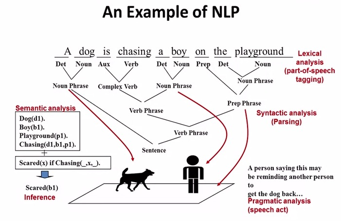

(https://www.coursera.org/course/textretrieval)[https://www.coursera.org/course/textretrieval] 

## What is Natural Language Processing?
- The process the computer has to go through, to understand text.

- **Lexical Analysis:** Classify each word according to the grammar rules
- **Syntactic analysis:** Classify the structure of the structure
- **Inference:** Think of something else when reading the sentence. If someone is being chased, maybe he is scared?
- **Pragmatic Analysis:** Understand the speaker, what is his goal? maybe to get another person to get the dog back

**NLP is difficult:**

- Difficult due to ambiguities. We assume listeners have common sense.
- word level ambiguity: design can be noun or verb, root has multiple meanings
- syntactic ambiguity: "A man saw a boy with a telescope" - who had the telescope?
- Anaphora resolution: "John persuaded Bill to buy a tv for him" - who is him?

**What we can't do:**

- 100% POS tagging: "He turned off the highway" vs. "He turned off the fan"
- General complete parsing
- Precise deep semantic analysis: 'John owns a restaurant'
- As a result we have mechanics to understand a lot of data in a shallow way

## Text Access
How can text information system help users get access to text data? There are two main modes data to get to users:

- Pull Mode (Search Engine): Users take initiative, ad hoc information need
- Push Mode (Recommender System): System take initiative. Stable information need or system has good knowledge about user's needs.

**Pull Mode:**

- Querying: user enter keyword, system returns documents. Works when users know what keywords to use
- Browsing: User navigates into relevant information by following a path by document structure. Works for exploratory mode.

## Text Retrieval Problem
How to support the pull mode. There are collection of texts, user enters a query and the system returns the matching document.

In TR the data is free text instead of schema based. The query is ambiguous instead of precise. The answers are the relevant documents instead of matched. And human evaluation is required to know what is a good matching algorithms

**Formal Definition:**

- Vocabulary: V(w1, w2, w3)
- Query: $q=q_1,...,q_n$ where $q_i \in V $
- Document: $ d_i= d_{i1},...,d_{im} \in V $
- Collection: $ C = \{ d_1,...,d_m \} $
- Set of relevant documents: $ R(Q) \subseteq C $
  - The relevant documents is different for each user.
  - Query is just a hint on which documents are in $R(q)$
- Task: compute $R'(q)$, an approximation of $R(q)$

**To compute R'(q):**

**Document Selection:**

- $ R'(q) = \{d \in C \mid f(d,q)=1 \} $ where $ f(d,q) \in \{0,1\} $ is a binary classifier
- Problem: Classifier is unlikely accurate. If the query is over constrained - no documents will be returned. If the query is under constrained - More documents than desired will be returned.
- Hard to find the right position between those two extremes.
- Missing prioritization.

**Document Ranking:**

- $ R'(q) = \{d \in C \mid f(d,q)>\theta \} $ where $ f(d,q) \in \mathbb{R} $ is a relevance measure function; $\theta$ is a cutoff determined by the user.
- System only needs to decide if one document is more likely relevant than another.
- Justified by the "Probability Ranking Principle" [Robertson 77]
- Ranking might be dependent (showing duplicate documents might not be desired) and ranking might be collective (three of the documents might collectively form the answer).

**Summary:**

- Main Challenge: Design effective $f(q,d)=?$
- Papers: S.E. Robertson, probability ranking principle in IR, 1977; C.J. van Rijsbergen, Information Retrieval, 2nd edition, Newton, 1979

## Text Retrieval Methods:
We need a retrieval model - that will formalize a definition of relevance.

**There are many kind of retrieval models:**

- Similarity based models: f(q,d) = similarity(q,d)
  - Vector space model
- Probabilistic models: $ f(d,q) = p(R=1 \mid d,q)$, where $R \in \{0,1\} $
  - Classic model
  - Language model
  - Divergence from randomness model
- Probabilistic inference model: $ f(q,d) = p(d \to q) $
- Axiomatic model: $f(q,d)$ must satisfy a set of constraints

**Common ideas:**

- TF: How often the term appears in the document
- $ \mid d\mid $ : Number of occurrences in smaller document is worth more than larger document
- df - Matching a rare term is worth more than a common term

Which models work the best?

- Properly tuned they all work equally well. These algorithms treat documents as "bag of words"
- Pivoted length normalization, BM25 (Most popular), Query likelihood, PL2

Papers:

- Diagnostic evaluation of information retrieval models (2011)
- Statistical language models for information retrieval (2008)

## Vector Space Model
Is a similarity based models: f(q,d) = similarity(q,d)

Vectors represent the relevance of terms in document  

- d1 - a document that talks about library and presidential, but not about programming.
- d2 - a document that talks about programming and library.
- We look for similarity between query vector and other vectors.

**Formally:**

- Represent doc/query by term vector
  - Term: word or phrase
  - Each term defines one dimension
  - N terms define N-dimensional space
  - Query vector: $ q=(x_1,...,x_N), x_i \in \mathbb{R} $ is query term weight
  - Doc vector: $ d=(y_1,...,y_N), y_j \in \mathbb{R} $ is doc term weight
- relevance(q,d) $\propto$ similarity(q,d)=f(q,d)

**Simplest VSM for search:**

- Dimensions can be words from the vocabulary.
- query $ q=(x_1,...,x_N) $, and document $ d= (y_1,...,y_N) $ vectors are bits, $ x_i, y_i \in \{ 0,1 \} $
- $ Sim(q,d) = q \cdot d $
- Basically matches how many of the query words match the document.

**Improved VSM:**

- Using TF and IDF can give better matching result.
- query $ q=(x_1,...,x_N) $ $ x_i $ is the count of word $ W_i $ in query
- document $ d= (y_1,...,y_N) $. $ y_i = c(W_i, d)*IDF(W_i) $ in the document

- Popular terms are penalized
- There is still a problem that less relevant document, that happens to contain some of the terms a lot, might get ranked very high.
- $ f(q,d) = \sum_{i=1}^N X_iY_i = \sum_{w \in q \cap d} c(w,q)c(w,d)log\frac{M+1}{df(W)} $
- the term c(w,d) is what multiplies term frequency without normalization

**BM25:**

- k is a regularization term, where we can decide how often a term need to appear for us to become confident enough that the document talks about the query. And more occurrences will not increase score.

**Document length normalization:**

- We should also penalize long documents, since they can match any document.

- b is the regularization parameter to control how much to penalize long documents.

- Pivoted length normalization uses term control at the top and document frequency at the bottom.
- BM25/Okapi - IDF on the right, Query TF on the left, TF transformation with upper bound on the top and bottom left, length normalization on the bottom right
- BM25+ [LV & Zhai 11] addresses problem of over penalization of long documents by BM25 by adding small constant to TF.
